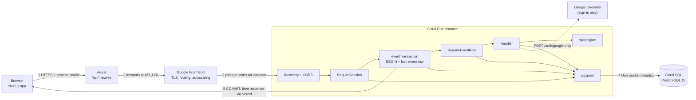
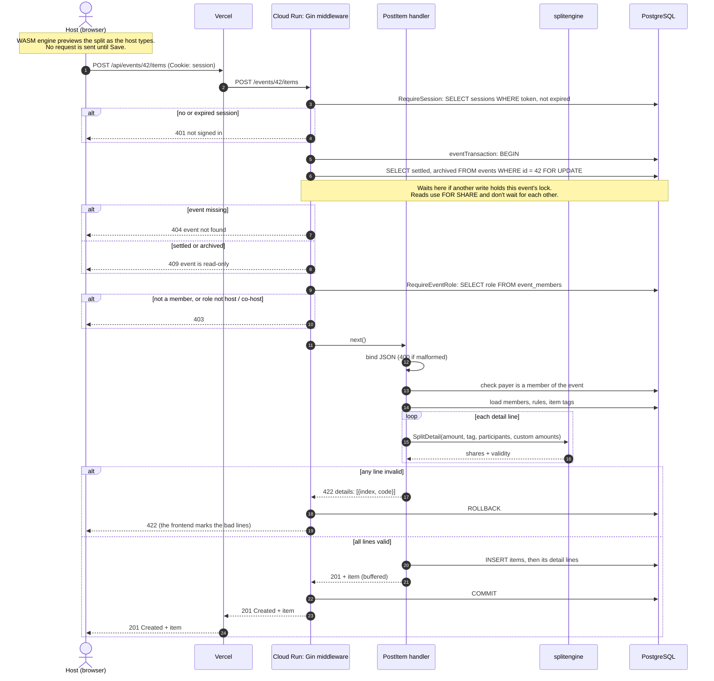
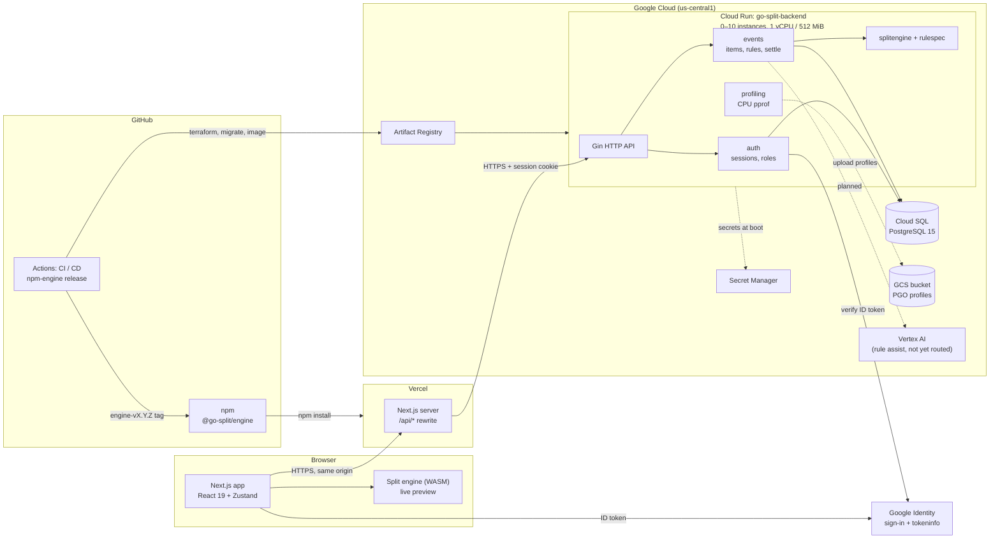

# 1. Application Architecture

Go-Split splits group expenses for an event. A host creates the event, invites
members by code, records expenses, and settles once. The browser previews each
split while the host types; the server calculates the result that counts.

The document has two views: the **runtime view** shows one request travelling
through the running system, and the **build and deploy view** shows where each
piece comes from and how it gets to production.

## Runtime view: one request, end to end

1. **Browser → Vercel.** The app calls `/api/...` on its own origin, with the
   `session` cookie attached.
2. **Vercel → Cloud Run.** The Next.js rewrite forwards the request to the
   backend URL (`API_URL`).
3. **Google Front End → instance.** Google terminates TLS and routes to a
   running instance. If none is running (scaled to zero), it starts one first,
   which is a cold start.
4. **Instance → database.** Each layer that needs data borrows a connection
   from the pgx pool and reaches Cloud SQL through the mounted Unix socket.
   Only `POST /auth/google` also calls Google, to check the ID token.
5. **Response.** For `/events/{id}/...` routes the handler's response is
   buffered. It is sent only after the transaction commits, and if the handler
   fails the transaction rolls back. So a client never sees a success for data
   that was not saved.

## Sequence: saving an expense (`POST /events/{id}/items`)

Saving an expense passes through every layer: session, event lock, role
check, validation with the split engine, and the database write.

The expensive part of the request is the database round trips (about 14 for a
two-line card, one or more per line), not the calculation. That's why the load test's latency rises when
requests queue for a pool connection or for the event's lock (see section 3).

## Build and deploy view

## Components

| Component | Where it runs | Job |
| --- | --- | --- |
| Next.js frontend | Vercel (`go-split.vercel.app`) | UI. Rewrites `/api/*` to the backend, so the browser talks to one origin and the session cookie stays first-party. |
| Split engine (WASM) | The user's browser | The same Go split code as the server, compiled to WASM (`cmd/splitengine-wasm`). It previews a split without a network call. Released to npm as `@go-split/engine`; the frontend copies the binary into its build. |
| Go API | Cloud Run, container built `FROM scratch` | Gin router. Runs database migrations and template seeding at startup, then serves HTTP on `:8080`. |
| `internal/auth` | Go API | Google sign-in, guest join by invite code, `HttpOnly` session cookie, and per-event roles (host, co-host, member, guest). |
| `internal/events` | Go API | Events, members, expense items, rules, tags, settlement, archive, and the shares/transfers reads. |
| `internal/splitengine`, `internal/rulespec` | Go API and WASM | Pure calculation: split one amount across members by rules, weights and fixed amounts, then work out who pays the host. No I/O. |
| `internal/profiling` | Go API | Collects CPU profiles in production and uploads them to GCS, used to build Go profile-guided optimization (PGO) (see `docs/pgo.md`). |
| `internal/ruleassist` | Go package only | Drafts split rules from a plain-language description through Vertex AI. Not connected to a route yet. |
| Cloud SQL | GCP | PostgreSQL 15 (`db-f1-micro`, one zone). Backups and point-in-time recovery on. Encrypted connections only; Cloud Run reaches it through the Cloud SQL Unix socket. |
| Secret Manager | GCP | Database password and Google client ID, read by the Cloud Run service account. |

## Main request flows

**Sign in.** The browser gets a Google ID token and sends it to
`POST /auth/google`. The API checks it with Google's `tokeninfo` endpoint (10 s
timeout), creates or finds the account, and sets a session cookie. Guests use
`POST /auth/join` with an invite code instead and get the same kind of cookie.

**Record an expense.** While the host edits, the browser runs the WASM engine
for a preview. On save, the API validates every line, runs the same engine, and
writes the item in one transaction. If any line is invalid, nothing is saved,
and the response is a 422 with a code for each bad line.

**Settle.** The host calls `POST /events/{id}/settle`. The API checks every
line again, then freezes the inputs, results, member order, host, and engine
version into a snapshot. After that the event is read-only; later reads come
from the snapshot, not a new calculation.

## Design decisions

- **One engine, two places.** The preview and the real result come from the
  same Go code, so they can't disagree. The server result is the one that counts.
- **The database enforces the rules too.** Exactly one host per event and
  read-only settled events are database constraints, not only API checks.
  Writes to one event are serialized in transactions, so a save and a
  settlement can't overlap.
- **Whole NT dollars.** Amounts are integers in dollars, with no cents and no
  silent rounding.
- **Same-origin proxy.** Routing API calls through Vercel keeps the cookie
  first-party, so browsers that block third-party cookies still work.
- **Scale to zero.** Cloud Run runs 0 to 10 instances. Idle cost is near zero;
  the trade-off is a cold start on the first request after a quiet period.

## Delivery pipeline

- **CI** (`.github/workflows/CI.yaml`, on PRs to `main`): unit tests with the
  race detector, lint, API end-to-end tests and a k6 load test, each against a
  throwaway PostgreSQL 15.
- **CD** (`cd.yaml`, on push to `main`): Terraform apply (`deploy/gcp`), run
  migrations through the Cloud SQL Auth Proxy, build and push the image to
  Artifact Registry, deploy to Cloud Run.
- **Engine release** (`npm-engine.yaml`, on an `engine-vX.Y.Z` tag): build,
  test and publish `@go-split/engine` to npm. It does not deploy the backend.
