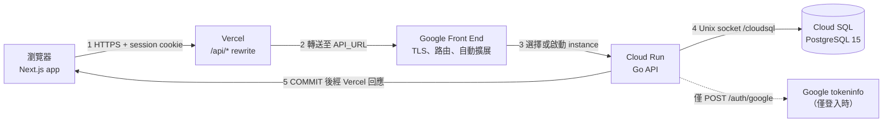
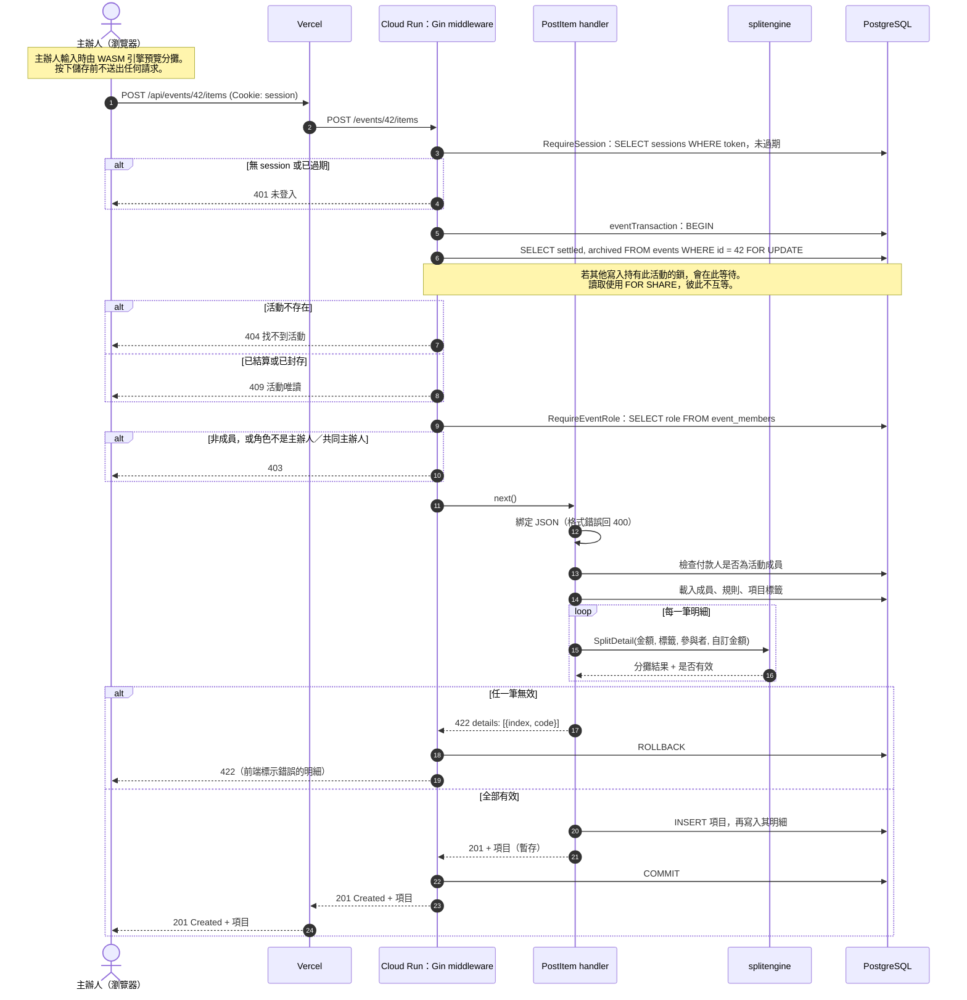

# 1. 應用程式架構

Go-Split 用來分攤一場活動的團體開銷。主辦人建立活動、以邀請碼邀請成員、記錄
開銷，最後一次結算。主辦人輸入時，瀏覽器會即時預覽每筆分攤；以伺服器算出的
結果為準。

本文件分為兩個視角：**執行期視角**呈現一個請求如何穿過運行中的系統，**建置與
部署視角**呈現各元件從何而來、如何上線。

## 執行期視角：一個請求的完整路徑

1. **瀏覽器 → Vercel。** 前端呼叫同源的 `/api/...`，並附上 `session` cookie。
2. **Vercel → Cloud Run。** Next.js rewrite 將請求轉送到後端網址（`API_URL`）。
3. **Google Front End → instance。** Google 終結 TLS 並路由到運行中的
   instance。若沒有任何 instance（已縮減至零），會先啟動一個，即冷啟動。
4. **Cloud Run → 資料庫。** API 從 pgx 連線池借用連線，經掛載的 Unix socket
   連到 Cloud SQL。只有 `POST /auth/google` 會另外呼叫 Google 驗證 ID token。
5. **回應。** `/events/{id}/...` 路由的回應會先暫存，等交易 commit 後才送出；
   若 handler 失敗則交易 rollback。因此用戶端不會對未儲存的資料收到成功回應。

## 循序圖：儲存一筆開銷（`POST /events/{id}/items`）

儲存開銷會經過每一層：session、活動鎖、角色檢查、以分攤引擎驗證，以及資料庫
寫入。

請求的主要成本在資料庫往返（兩筆明細的卡片約 14 次，每筆明細至少一次），而不是
計算本身。因此當請求排隊等待連線池或活動鎖時，負載測試的延遲會上升（見第 3 節）。

## 建置與部署視角

- **後端 CI**（PR 到 `main`）：race detector 單元測試、lint、API 端對端測試與 k6
  負載測試，皆在一次性的 PostgreSQL 15 上執行。
- **後端 CD**（push 到 `main`）：Terraform apply、經 Cloud SQL Auth Proxy 執行
  migration、推送 image 到 Artifact Registry 並部署到 Cloud Run。
- **前端**（push 到 `main`）：Vercel 的 GitHub 整合自動建置並部署到正式環境。
  建置前 `sync-engine` 從 `@go-split/engine` 複製 `engine.wasm`，所以前端換用新版
  引擎只需升級 npm 套件。
- **引擎發布**（`engine-vX.Y.Z` tag）：建置、測試並發布 `@go-split/engine`。

## 為什麼是這個架構

每個選擇都對應產品的一個限制：

- **預覽必須即時，且與結果一致 → 同一個 Go 引擎跑在兩處。** 主辦人調整規則或
  金額時要立刻看到每人分攤，等網路往返太慢；但若前端另寫一套 JS 計算，兩邊遲早
  算出不同數字。把伺服器的 Go 程式碼編譯成 WASM，預覽與正式結果就不會分歧，
  且以伺服器結果為準。
- **沒有自有網域 → 經 Next.js server 代理。** 前端在 `go-split.vercel.app`、
  後端在 Cloud Run 的 `run.app` 網址，兩者屬於不同網站。所有使用者都靠
  session cookie 維持身分；若瀏覽器直接跨網站呼叫 Cloud Run，
  cookie 會成為第三方，Safari 等瀏覽器會擋掉。經由 Vercel 的 `/api/*` rewrite
  轉送，瀏覽器只看到同一個來源，cookie 維持第一方。
- **金額不能算錯，主辦人與共同主辦人可能同時編輯 → 交易與資料庫約束。** 同一活動
  的寫入在交易中鎖住活動列並序列化；「恰有一位主辦人」「已結算即唯讀」由資料庫
  約束保證；回應等 commit 後才送出，用戶端不會看到未儲存的成功。金額一律為新台幣
  整數元，不默默四捨五入。
- **結算後結果不能變 → 快照。** 結算時凍結輸入、結果、成員順序與引擎版本；之後
  即使引擎升級，舊活動仍讀取當時的快照。
- **用量集中在活動期間，平時幾乎閒置 → Cloud Run 縮減至零。** 一場旅行結束後
  可能數週沒有請求，按用量計費讓閒置成本趨近於零；代價是閒置後的第一個請求會
  冷啟動。Cloud SQL 選 `db-f1-micro` 也是同樣的取捨，連線上限見第 3 節。
- **小團隊、時程有限 → 全用託管服務，基礎設施即程式碼。** Vercel、Cloud Run、
  Cloud SQL 免去維運；Terraform 與 GitHub Actions 讓每次合併到 `main` 都自動部署，
  不依賴個人手動操作。
