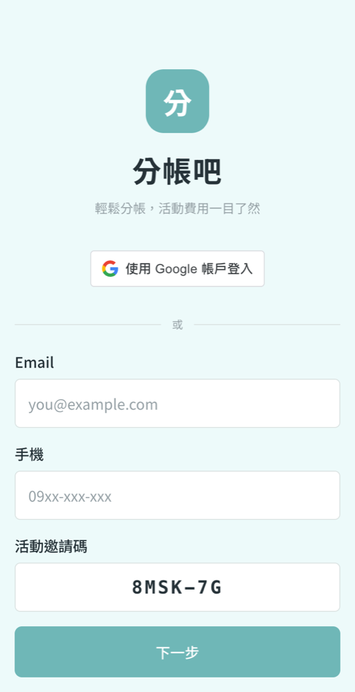
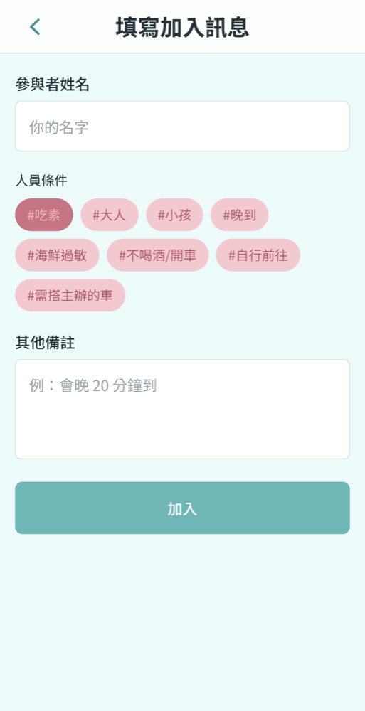
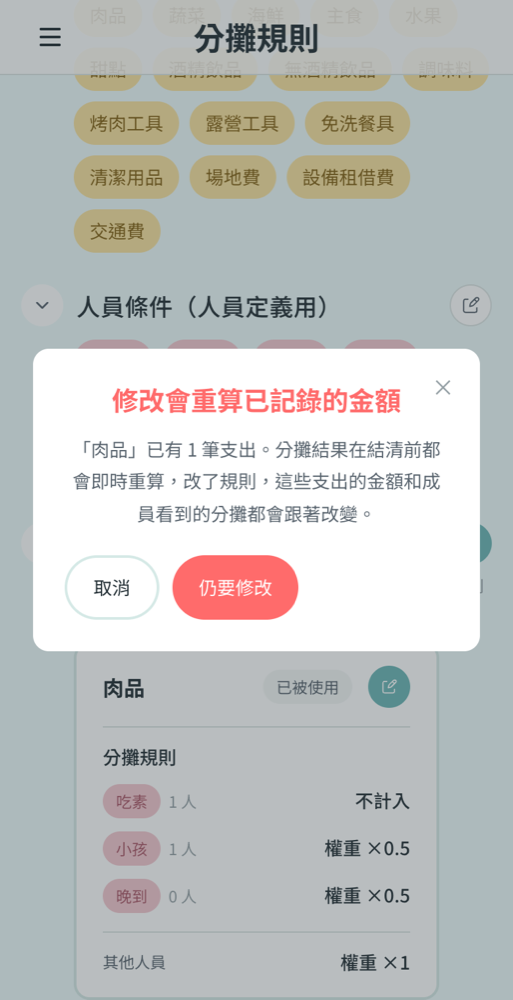
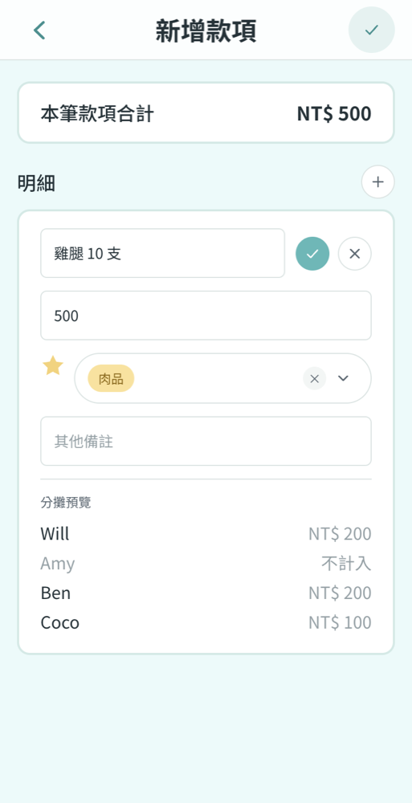
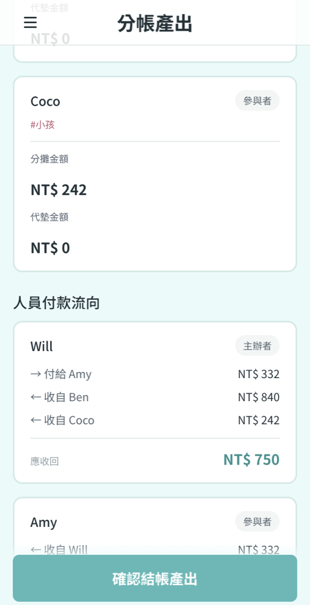
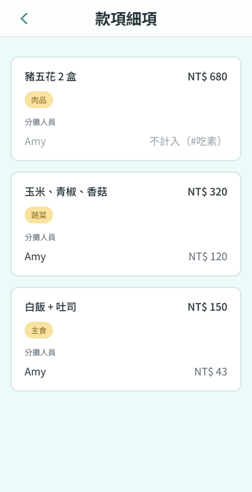

# 2. Interface & User Experience Design

Go-Split is used on a phone, often in the middle of the event. There are two
roles. The **host** signs in with Google and does the bookkeeping. **Members**
join as guests without an account and mostly read their own share. This section
covers the three flows that decide whether a split goes well: joining, setting
rules, and settling.

Screenshots: headless Chrome (Playwright), 390 px wide, local frontend and
backend, sample event 河濱烤肉 with a host (Will) and three guests: Amy (#吃素),
Ben (#不喝酒/開車) and Coco (#小孩).

## 2.1 Joining without an account

<table><tr>
<td></td>
<td></td>
</tr></table>

**Why it is critical.** The host can't split anything until everyone has
joined. If joining is slow, the host ends up typing in everyone's details.
Joining is also when members state the conditions that change their share.

**Design decisions**

- **No account for guests.** The QR code and link open `/login?invite=CODE`
  with the code already filled in. A guest gives only an email and a phone
  number. Google sign-in is offered but not required.
- **Members state their own conditions.** Step 2 shows the event's own
  condition list (#吃素, #小孩 …). The list is loaded with a public lookup by
  invite code, which returns only the event name and the list. The host
  doesn't need to know who is vegetarian.
- **Recovery without a password.** Entering the same email, phone and code
  on a new device signs the guest back in to the same member. After
  settlement the code returns `410`.

## 2.2 Rules decide the split

<table><tr>
<td></td>
<td></td>
</tr></table>

**Why it is critical.** The hard part of a group split is not the
arithmetic. It is "who shares what": vegetarians don't pay for meat, and a
child pays half. Splitting each line by hand is where mistakes happen, so the
product moves that work into rules that the host sets once.

**Design decisions**

- **Templates first.** Picking 烤肉/露營 seeds item tags, member conditions
  and rules (for example, 肉品: #吃素 不計入, #小孩 ×0.5). Most hosts never
  have to open the rule editor.
- **Tag the line, and see the split before saving.** The host enters a name,
  an amount and a tag, and the form previews each member's share as they
  type. For NT$ 500 of meat: Will and Ben pay 200, Coco pays 100 (#小孩 ×0.5),
  and Amy is not counted.
- **The browser runs the server's engine.** The preview and the rule
  editor's checks use the Go engine compiled to WASM. So what the host sees
  before saving is what the API stores.
- **Warn before changing past results.** Shares are recalculated live until
  settlement. So editing a rule that expenses already use opens a dialog that
  says how many expense lines will change. Used tags and rules have no delete
  button, and the API rejects deleting them with `409`.

## 2.3 Settlement and what each member sees

<table><tr>
<td></td>
<td></td>
</tr></table>

**Why it is critical.** Settlement is the only step that can't be undone, and
it produces the amounts people actually pay.

**Design decisions**

- **Preview the exact result that will be frozen.** The page shows every
  expense, what each member owes and has paid, and the transfers. Confirming
  asks once more, because settling can't be undone. Then it saves the note
  and calls `POST /settle`, which checks every line again. If
  any line is invalid, it returns `422`, the page shows a banner, and nothing
  is frozen.
- **All transfers go through the host.** Each member has a single transfer:
  pay the host or get paid by the host. In the screenshot, Will pays Amy 332
  and receives 840 from Ben and 242 from Coco, which nets to 750. This is
  easier to follow than a minimal-transfer graph between members.
- **Members see only their own numbers.** Before archive, a member sees
  every expense amount but only their own share (right screenshot: Amy). A
  line that leaves them out says why: 不計入（#吃素）. The host sees
  everyone's. This keeps the member view short and keeps others' shares
  private.

## Gaps found while writing this section

Taking these screenshots turned up four gaps. The screenshots above show the
fixed versions:

- Settling had no confirmation, and the event header showed the creation
  time instead of the event date. Both are fixed in
  [go-split-frontend#19](https://github.com/2026-MentorShip-Project/go-split-frontend/pull/19).
- A member left out of a line saw no reason. Fixed in #19.
- The new-expense form had no live preview. Fixed in #19, and
  [#9](https://github.com/2026-MentorShip-Project/go-split-frontend/pull/9)
  covers it too, with the same preview in the rule editor.
