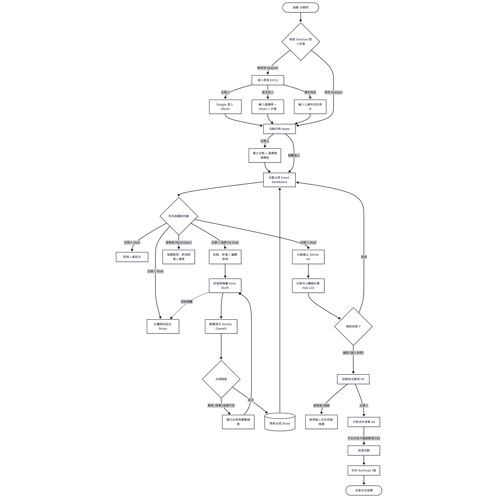

# 2. 介面與使用者體驗設計

系統有兩種角色：**主辦人**以 Google 登入並負責記帳；**成員**可以以訪客身分加入、不需帳號，主要查看自己的分攤。
下圖是完整的使用者流程；本節從中挑出決定分帳是否順利的三個流程：加入、設定規則、
結算。

## 2.1 不需帳號即可加入

<table><tr>
<td></td>
<td></td>
</tr></table>

**設計決策**

- **訪客不需帳號。** QR code 與連結會開啟 `/login?invite=CODE`，邀請碼已預先
  填好。訪客只需提供 email 與手機號碼。提供 Google 登入但非必要。
- **成員自行表明條件。** 第 2 步顯示該活動自己的條件清單（#吃素、#小孩 …）。
  清單透過以邀請碼查詢的公開 API 載入，只回傳活動名稱與清單。主辦人不需要知道
  誰吃素。

## 2.2 由規則決定分攤

<table><tr>
<td></td>
<td></td>
</tr></table>

**為什麼關鍵。** 團體分帳的難處不在算術，而在「誰分攤什麼」：吃素的人不付肉錢，
小孩付一半。逐筆手動分攤最容易出錯，所以產品把這件事交給主辦人設定一次的規則。

**設計決策**

- **範本優先。** 選擇「烤肉」或「露營」會預先建立項目標籤、成員條件與規則（例如
  肉品：#吃素 不計入、#小孩 ×0.5）。多數主辦人從不需要打開規則編輯器。
- **為明細加上標籤，儲存前即可看到分攤。** 主辦人輸入名稱、金額與標籤，表單會
  隨輸入即時預覽每位成員的分攤與原因。以 NT$ 500 的肉品為例：Will 與 Ben 各付
  200，Coco 付 100（小孩，權重 ×0.5），Amy 顯示「不計入（#吃素）」。
- **瀏覽器執行伺服器的引擎。** 預覽與規則編輯器的檢查都使用編譯成 WASM 的 Go
  引擎，因此主辦人儲存前看到的，就是 API 存下的結果。
- **變更既有結果前先警告。** 結算前分攤會即時重新計算，所以編輯已被開銷使用的
  規則時，會跳出對話框說明有幾筆明細會改變。已使用的標籤與規則沒有刪除按鈕，
  API 也會以 `409` 拒絕刪除。

## 2.3 結算與每位成員看到的內容

<table><tr>
<td></td>
<td></td>
</tr></table>

**為什麼關鍵。** 結算是唯一無法復原的步驟，而且會產生大家實際要付的金額。

**設計決策**

- **預覽即將凍結的確切結果。** 頁面顯示每筆開銷、每人應付與已付金額及轉帳，確認時
  再問一次。伺服器結算前會再檢查每一筆明細，有任何無效就回 `422`，不凍結任何資料。
- **所有轉帳都經過主辦人。** 每位成員只有一筆轉帳：付給主辦人，或由主辦人付給你，
  比成員之間的最少轉帳圖更容易理解。
- **成員只看到自己的數字。** 成員看得到每筆開銷金額，但只看到自己的分攤；不計入時
  會說明原因（「不計入（#吃素）」）。主辦人看得到所有人的分攤。
